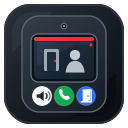

# SIP Indoor Station Integration

<p align="center">
  
</p>

<p align="center">
  <a href="https://my.home-assistant.io/redirect/hacs_repository/?owner=arturzx&repository=sip-indoor-station-integration&category=integration">
    
  </a>
</p>

Home Assistant integration for the [SIP Indoor Station add-on](https://github.com/arturzx/hass-addons/tree/master/sip_indoor_station).

## Requirements

- Add-on installed and running in Home Assistant.
- SIP Indoor Station Card installed when you want the dashboard history browser and intercom controls.

## Entities

The integration creates door station device, with these entities:

- `binary_sensor.<device>_registered`: Registered
- `binary_sensor.<device>_ringing`: Ringing
- `binary_sensor.<device>_in_call`: In call
- `sensor.<device>_call_state`: Call state
- `sensor.<device>_last_call`: Last call
- `sensor.<device>_last_missed_call`: Last missed call
- `sensor.<device>_missed_call_count`: Missed call count
- `button.<device>_answer`: Answer
- `button.<device>_reject`: Reject
- `button.<device>_hang_up`: Hang up
- `button.<device>_open_door`: Open door
- `button.<device>_reboot`: Reboot

Possible call state values:

- `idle`: no call is active.
- `ringing`: an incoming call is waiting for answer or rejection.
- `answered`: the call has been answered and is active.
- `rejected`: the incoming call was rejected by user.
- `cancelled`: the caller cancelled the call before it was answered or timeout occurred.
- `ended`: the active call ended normally (by user or caller).
- `failed`: the call failed.

The call-state sensor also includes useful attributes such as `call_id`, `remote_ip`, registration source, selected audio codec, and last event metadata.

## Call History

When call history is enabled in the add-on, the integration exposes recent call history through summary sensors and authenticated Home Assistant proxy endpoints which can be utilized by history card.

History sensors:

- `sensor.<device>_last_call`: timestamp of the most recent call.
- `sensor.<device>_last_missed_call`: timestamp of the most recent missed call.
- `sensor.<device>_missed_call_count`: number of missed calls in the currently loaded history.

The last-call sensors include the selected history entry as attributes, including `id`, `sip_call_id`, `status`, `started_at`, `answered_at`, `ended_at`, `remote_ip`, `has_snapshot`, and `snapshot_url` when a snapshot is available.

The missed-call count sensor includes `total_loaded_calls` as an attribute.

Deleting history through the proxy refreshes the history coordinator, so `last_call`, `last_missed_call`, and `missed_call_count` update after deletes.

## Services

The integration registers these services:

- `sip_indoor_station.refresh_call_history`
- `sip_indoor_station.delete_call_history_entry`
- `sip_indoor_station.clear_call_history`

`entry_id` is optional. Leave it empty when using a single SIP Indoor Station integration instance.

`delete_call_history_entry` requires `history_id`, which is the UUID from the history API or the `id` attribute on the last-call sensors.

## Installation

### HACS (Recommended)

Open this repository in HACS:

<a href="https://my.home-assistant.io/redirect/hacs_repository/?owner=arturzx&repository=sip-indoor-station-integration&category=integration">

</a>

Or add it manually in HACS:

1. Open HACS.
2. Open the three-dot menu and select **Custom repositories**.
3. Add `https://github.com/arturzx/sip-indoor-station-integration`.
4. Select category `Integration`.
5. Install `SIP Indoor Station`.
6. Restart Home Assistant.

Then add the integration from:

```text
Settings -> Devices & services -> Add integration -> SIP Indoor Station
```

### Manual

Copy `custom_components/sip_indoor_station` into your Home Assistant `custom_components` directory.

For local brand icon display, also copy `brands/custom_integrations/sip_indoor_station/icon.png` to:

```text
config/brands/custom_integrations/sip_indoor_station/icon.png
```

Then restart Home Assistant.

Then add the integration from:

```text
Settings -> Devices & services -> Add integration -> SIP Indoor Station
```

## Configuration

Device name defaults to:

```text
Door station
```

Default add-on slug:

```text
c1b42bc7_sip_indoor_station
```

By default, the integration proxies to:

```text
http://c1b42bc7-sip-indoor-station:8080
```

If your add-on hostname differs, set `Add-on URL` explicitly during setup.

## Notes

- SIP, ISAPI, RTP, and WebRTC media handling stay inside the add-on.
- This integration owns Home Assistant entities and actions.
